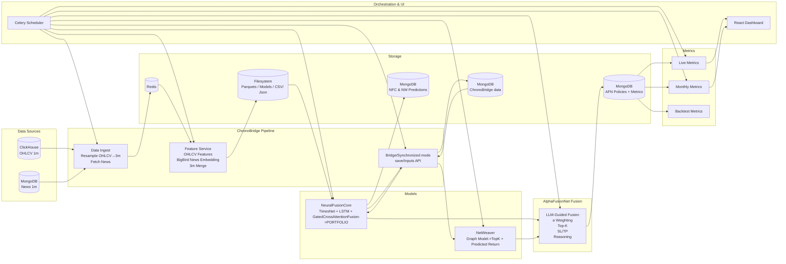

# AlphaFusionNet — LLM‑Guided Neural + Graph Market Monitoring Engine

 **Compliance note (important):** This repository is designed for **market monitoring, risk awareness, market structure analysis, and data/ops governance**.  
 It is **not** an investment advisory product and **must not** be used to generate or present:
 - buy/sell or long/short instructions, entry/exit, target prices, TP/SL  
 - allocations, portfolio/weight recommendations, “best opportunities,” expected returns  
 - PnL, outperformance/underperformance claims, or performance marketing outputs  

 If you build UI/outputs on top of this repo, keep the language **descriptive/diagnostic**, not directive.

---

## What this repo does

This repository provides an end‑to‑end pipeline that integrates four core components:

1) **NeuralFusionCore**  
   Ingests recent **OHLCV** + **news** and produces per‑symbol **model salience signals** (internally stored as signed values, but can be exposed in compliance‑safe form as **magnitude / tiers** only).

2) **ChronoBridge**  
   Generates **time‑aligned fused embeddings** (price + news) and persists them for downstream retrieval.

3) **NetWeaver**  
   Learns **cross‑symbol dependencies** via a graph model and produces:
   - a **rank/score** per symbol (use as *relative attention*, not “expected return”)  
   - an optional **dependency graph** describing probabilistic linkages.

4) **AlphaFusionNet (Fusion + Reasoning Service)**  
   Fuses model signals and produces **monitoring‑oriented outputs**, such as:
   - risk/attention **watchlists** (top‑K symbols to monitor)  
   - market/network structure summaries  
   - governance artifacts (policy JSON, audit logs, data freshness flags)  
   - diagnostic text (LLM‑generated), strictly constrained to **risk/structure/monitoring** language.

---

## High‑level capabilities

- Real‑time multimodal ingestion (OHLCV + news) and feature synchronization  
- Fused embeddings for downstream graph modeling  
- Network dependency modeling (influence, lead‑lag linkages, clusters)  
- Compliance‑safe dashboards:
  - **Market snapshot** (risk temperature, news heat, correlation stress, regime shift likelihood)  
  - **Risk & attention watchlist** (symbols that require monitoring)  
  - **Risk pack table** for the universe (volatility tiers, liquidity stress tiers, drawdown/tail risk buckets, data quality flags)  
  - **Network view** (influence leaderboard, probabilistic influence map, contagion stress)

---

## Table of contents

1. [Architecture diagram](#architecture-diagram)  
2. [Required downloads](#required-downloads)  
3. [Setup](#setup)  
4. [Pipeline](#pipeline)  
   - [Run ChronoBridge API service](#1-run-chronobridge-api-service)  
   - [Run AlphaFusionNet API service](#2-run-alphafusionnet-api-service)  
   - [Run scheduler](#3-run-scheduler)  
   - [Run tests](#4-run-tests)  
5. [Script cheat‑sheet](#script-cheat-sheet)  
6. [Dependencies](#dependencies)  
7. [Appendix](#appendix)  
8. [Authors & citation](#authors--citation)  
9. [Support](#support)  

---

## Architecture Diagram
AlphaFusionNet is a hybrid portfolio decision-making engine that fuses deep quantitative modeling with qualitative LLM-guided policy reasoning. It integrates real-time multimodal data ingestion, feature engineering, TimesNet-based MarketNews MSGCA-fusion modeling, graph modeling, fusion logic, and full metric monitoring, all orchestrated in UTC via Celery.
[For more details about this architecture, please refer to this.](./docs/architecture.md)


## Setup

```bash
# Clone repository
git clone https://github.com/Novoxpert/AlphaFusionNet.git
cd AlphaFusionNet
git submodule update --init --recursive

# (optional) create a virtual environment
python -m venv .venv

# Linux/macOS:
source .venv/bin/activate

# Windows (PowerShell):
.\.venv\Scripts\Activate.ps1

# Install dependencies
# Linux:
pip install -r requirements.txt
# Windows:
pip install -r requirements-windows.txt
```

---

## Pipeline

This pipeline coordinates ChronoBridge data services, model APIs, and scheduled tasks to produce synchronized features and monitoring outputs.  
Full usage notes: `./docs/usage.md`

### 1) Run ChronoBridge API service

API for retrieving fused embeddings and OHLCV per symbol from MongoDB.

```bash
python -m apps.ChronoBridge.scripts.chronobridge_api_service
```

### 2) Run AlphaFusionNet API service

API for retrieving latest **monitoring outputs** from MongoDB.

```bash
python -m scripts.alphafusionnet_api_service
```

### 3) Run scheduler

```bash
# Linux:
celery -A scheduler.tasks worker --loglevel=info --concurrency=1

# Windows:
celery -A scheduler.tasks worker --loglevel=info -P threads --concurrency=1

python run_triggers.py
celery -A scheduler.scheduler beat --loglevel=info
```

Typical outputs include processed parquet files, model checkpoints, and MongoDB collections such as:
`chrono_bridge`, `NeuralFusionCore_predictions`, `NetWeaver_predictions`, `AlphaFusionNet_predictions`, `live_metrics`, `monthly`, `windows`, etc.

### 4) Run tests

```bash
pip install pytest
pytest -v tests
```

---

## Script cheat‑sheet

For the full engine layout, see `./docs/layout.md`.

- `apps/NeuralFusionCore/lib/*.py` — datasets, models, training loops, utilities, backtesting  
- `apps/ChronoBridge/scripts/data_ingest_service.py` — fetch OHLCV/news and push to Redis  
- `apps/ChronoBridge/scripts/features_service.py` — build features & fused embeddings  
- `apps/NeuralFusionCore/scripts/train_service.py` — train model  
- `apps/NeuralFusionCore/scripts/finetune_service.py` — incremental fine‑tuning  
- `apps/NeuralFusionCore/scripts/prediction_service.py` — scheduled inference (writes to MongoDB/Redis)  
- `apps/NetWeaver/src/services/netweaver_train_service.py` — train graph model  
- `apps/NetWeaver/src/services/netweaver_prediction_service.py` — graph inference and ranking/graph outputs  
- `scripts/alphafusionnet_service.py` — fusion + guardrailed reasoning + persistence  
- `scripts/metric_live_service.py` — live monitoring metrics  
- `scripts/metric_monthly_service.py` — periodic summary metrics  
- `scripts/metric_backtesting.py` — historical validation runs (non‑advice evaluation)  

---

## Dependencies

- Python 3.12+  
- PyTorch 2.x  

---

## Appendix

### Upstream repositories

- NeuralFusionCore: https://github.com/Novoxpert/NeuralFusionCore  
- ChronoBridge: https://github.com/Novoxpert/ChronoBridge  
- NetWeaver: https://github.com/Novoxpert/NetWeaver  

---

## Authors & citation

Developed by the Novoxpert Research Team.  
If you use this repository or build upon our work, please cite:

> Novoxpert Research (2025). *AlphaFusionNet: LLM‑Guided Neural + Graph Market Monitoring Engine.*  
> GitHub: https://github.com/Novoxpert/AlphaFusionNet

---

## Support

- Issues & Bugs: https://github.com/Novoxpert/AlphaFusionNet/issues  
- Discussions: https://github.com/Novoxpert/AlphaFusionNet/discussions  
