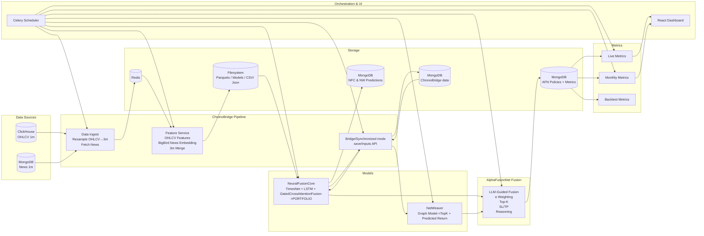

# AlphaFusionNet: LLM-Driven Neural–Graph Portfolio Engine

This repository provides an end-to-end pipeline for portfolio modeling that integrates three core components: **NeuralFusionCore**, which directly predicts portfolio weights; **ChronoBridge**, which generates time-aligned fused embeddings; **NetWeaver**, which leverages these embeddings for downstream portfolio optimization and analysis; and **AlphaFusionNet**, which is a Hybrid Portfolio Decision-Making Engine.

The NeuralFusionCore ingests the latest OHLCV data and financial news, constructs the most recent temporal window, encodes news using a large language model (LLM), performs a forward inference pass, and outputs the current portfolio weights. In addition, ChronoBridge extracts trained fused embeddings for each asset and stores them in MongoDB for subsequent retrieval and analysis. NetWeaver is a comprehensive stock prediction system leveraging Graph Attention Networks (GAT) to model relationships between stocks—both within industries (intra-sector) and across industries (inter-sector). It combines sequential encoding with graph-based learning to predict profitable stock movements and recommend top-K stocks. AlphaFusionNet provides the main service for AlphaFusionNet, a hybrid portfolio decision-making engine that fuses outputs from two intelligent portfolio modules — NeuralFusionCore and NetWeaver — and combines both quantitative and qualitative reasoning to produce final portfolio weights.

It supports:
1) Data ingesting from databases using redis
2) Dataset preparation  
3) for NeuralFusionCore Training a direct‑weights MarketNews-Fusion model  
4) save Real-time predictions to MongoDB as NeuralFusionCore output
5) Generating realtime Fused Embedding of (ohlcv + news) as ChronoBridge output
6) FastAPI service to serve latest ChronoBridge outputs for Netweaver
7) Combining sequential encoding with graph-based learning, training and predicting profitable stock movements and recommending top-K stocks with their predicted return ratio as NetWeaver output.
8) Fusing outputs from NeuralFusionCore and NetWeaver 
9) Combining both quantitative and qualitative reasoning and producing final portfolio weights
10) performing a **single-minute computation** of live portfolio performance metrics for the current 4-hour trading window and computes **current month-to-date (MTD)** portfolio performance.
11) Full CI-quality testing and unit testing suite that validates API, model, data pipeline, and persistence.

[For more details about this engine, please refer to the documents here.](./docs)

## Table of Contents

1. [Architecture Diagram](#architecture-diagram) 
2. [Required Downloads](#required-downloads)  
3. [Setup](#setup)  
4. [Pipeline](#pipeline)  
   - [Run ChronoBridge API Service](#1-run-chronobridge-api-service)
   - [run AlphaFusionNet API service](#2-run-alphafusionnet-api-service)
   - [Run Scheduler](#3-run-scheduler)   
   - [Run Tests](#4-run-tests)  
5. [Script Cheat-Sheet](#script-cheat-sheet)  
6. [Dependencies](#dependencies)  
7. [Appendix](#appendix)  
   - [Upstream Repositories](#upstream-repositories)   
8. [Authors & Citation](#authors--citation)  
9. [Support](#support)
---
## Architecture Diagram
AlphaFusionNet is a hybrid portfolio decision-making engine that fuses deep quantitative modeling with qualitative LLM-guided policy reasoning. It integrates real-time multimodal data ingestion, feature engineering, TimesNet-based MarketNews MSGCA-fusion modeling, graph modeling, fusion logic, and full metric monitoring, all orchestrated in UTC via Celery.
[For more details about this architecture, please refer to this.](./docs/architecture.md)

---
## Required Downloads

### LLM models (for news embeddings, etc.)
Place downloaded models under a folder you will reference (e.g. `apps/NeuralFusionCore/models/` at repo root):

- https://drive.google.com/drive/folders/1htASoZVoRYkjzl8Svsi8fxc-x7eUEtCO?usp=sharing


## Setup

```bash

# Clone repository
git clone https://github.com/Novoxpert/AlphaFusionNet.git
cd AlphaFusionNet
git submodule update --init --recursive


# (optional) create a virtual environment
python -m venv .venv

# Linux/macOS:
source .venv/bin/activate

# Windows (PowerShell):
 .\.venv\Scripts\Activate.ps1

# install exact dependencies
pip install -r requirements.txt
```
---
## Pipeline 
This pipeline coordinates ChronoBridge data services, model APIs, and scheduled tasks to produce synchronized features, predictions, and portfolio decisions. Follow the steps below to run the complete AlphaFusionNet workflow from data ingestion to deployment. [For having full usage pipeline, please refer to this.](./docs/usage.md)

### 1) run ChronoBridge API service
Create API for Get Fused embedding and ohlcv per asset from Mongodb.
```bash
python -m apps.ChronoBridge.scripts.chronobridge_api_service 
```
### 2) run AlphaFusionNet API service
Create API for Get weights from Mongodb.

```bash
python -m scripts.alphafusionnet_api_service
```
### 3) run scheduler    

```bash

celery -A scheduler.tasks worker --loglevel=info 
python run_triggers.py
celery -A scheduler.scheduler beat --loglevel=info
```
Outputs:  a checkpoint such as `apps/NeuralFusionCore/data/outputs/model_weights.pt` and 
        `apps/NeuralFusionCore/data/processed/train.parquet`, `val.parquet` 
        ,`finetune_train.parquet`, `finetune_val.parquet`, `online_test.parquet`,
        `online_bridge.parquet`, `online_bridge_not_norm.parquet`,`online_metric.parquet`, `online_metric_not_norm.parquet`,
        `meta.json`, `normalizer.pkl` and `apps/NeuralFusionCore/data/processed/backtesting` and
        `NeuralFusionCore_predictions` , `chrono_bridge` , `NetWeaver_predictions`, `AlphaFusionNet_predictions`, `AlphaFusionNet_future_testing` , `windows`, `live_metrics`, `monthly` collections created in database of MongoDB

### 4) run tests
run Full CI-quality testing and unit testing suite.
```bash
pip install pytest
pytest -v tests
```
---
## Script Cheat‑Sheet
This section provides a quick-access reference to all major scripts in the AlphaFusionNet ecosystem, outlining what each component does and how to invoke it during development, training, backtesting, and production workflows. [For having the complete engine layout, please refer to this.](./docs/layout.md)
- **`apps/NeuralFusionCore/lib/*.py`** — internal modules for datasets, models, training loops, utilities, and backtesting specialized for direct weights.  
- **`apps/NeuralFusionCore/config.py`** — central configuration / argument helpers used by the scripts.
- **`apps/ChronoBridge/data_ingest_service.py`** — fetch OHLCV from ClickHouse and news from Mongo for the given interval, and push results (per-symbol ohlcv DataFrame pickles and news DataFrame) to Redis.

Modes:
  - latest:       fetch last hours data from DBs and save to redis
  - historical:   fetch historical days data from DBs and save  to redis
  - custom:       fetch data from DBs in custom time period

Usage examples:
one-shot latest 4h (use scheduler to run every 4h)
```bash
python -m apps.ChronoBridge.scripts.data_ingest_service --mode latest --hours 4
```
- **`apps/ChronoBridge/scripts/features_service.py`** — Builds features from Redis.

Modes:
  - train:          full rebuild (includes normalizer + meta)
  - finetune:       incremental build (reuse existing normalizer/meta)
  - inference:      build features for inference only (produces online_test.parquet)
  - bridge:         build features for ChronobBridge only
  - synchronize:      build synchronize features for ChronobBridge and NeuralFusionCore 
  - backtesting:    build features for back testing the model
  - future_testing: build features for forward-looking in live tesing 
  - time:           select data by start_time/end_time for any mode

Usage Examples:
```bash
python -m apps.ChronoBridge.scripts.features_service --mode finetune --latest_hours 24
```
- **`apps/NeuralFusionCore/scripts/train_service.py`** — Train from scratch on processed/train.parquet and processed/val.parquet
Usage Example:
```bash
python -m apps.NeuralFusionCore.scripts.train_service --epochs 50 
```
- **`apps/NeuralFusionCore/scripts/finetune_service.py`** —Fine-tune an existing saved model using the latest features. If validation loss improves, replace saved model and keep previous version with timestamp.

Usage Example:
```bash
python -m apps.NeuralFusionCore.scripts.finetune_service --epochs 10 --save_best
```
- **`apps/NeuralFusionCore/scripts/prediction_service.py`** —Scheduled inference: fetch latest data, compute features, infer model, transform logits into portfolio weights, and save predictions to MongoDB and Redis.

Modes:
  - inference:    Fetch data, build features, infer, save outputs   
  - synchronize:  Only run inference + saving (data assumed prepared)

Usage Example:
```bash
python -m apps.NeuralFusionCore.scripts.prediction_service --hours 4 
```
- **`apps/NeuralFusionCore/scripts/backtesting_service.py`** —Backtesting & Model Evaluation Service for Market-News Fusion Model.

Usage Example:
```bash
python -m apps.NeuralFusionCore.scripts.backtesting_service --epochs 50 --mode fetch --hours 12 
```
- **`apps/NeuralFusionCore/scripts/api_service.py`** — create API for Get NeuralFusion weights from Mongodb.
- **`apps/ChronoBridge/scripts/chronobridge_service.py`** — extract trained fused embeddings per asset and store in MongoDB.

Modes:
  - bridge:       Complete pipeline for NetWeaver usage  
  - synchronize:  Full sync pipeline for latest window

Usage Example:
```bash
python -m apps.ChronoBridge.scripts.chronobridge_service --mode synchronize --hours 4 
```
- **`apps/ChronoBridge/scripts/chronobridge_api_service.py`** — create API for Get Fused embeddings from Mongodb.
Usage Example:
```bash
python -m apps.ChronoBridge.scripts.chronobridge_api_service
```
- **`apps/NetWeaver/src/services/netweaver_train_service.py`** — Train NetWeaver model from scratch with data from the past month(s).
Usage Example:
```bash
python -m NetWeaver.src.services.netweaver_train_service --latest_month 4 --no_analysis 
```
- **`apps/NetWeaver/src/services/netweaver_finetune_service.py`** — Fine-tune NetWeaver model with data from the past few hours. 
Usage Example:
```bash
python -m NetWeaver.src.services.netweaver_finetune_service --latest_hours 20 --no_analysis 
```
- **`apps/NetWeaver/src/services/netweaver_prediction_service.py`** — NetWeaver prediction service for generating portfolio weights with recent hours data. 
Usage Example:
```bash
python -m NetWeaver.src.netweaver_prediction_service --latest_hours 6 --future_steps 80 --no_timestamp
```
- **`src/*.py`** — internal modules for quantitative, qualitative, reasoning agents and controller.  
- **`scripts/alphafusionnet_service.py`** —Fuses outputs from two intelligent portfolio modules — NeuralFusionCore and NetWeaver — and combines both quantitative and qualitative reasoning to produce final portfolio weights.

Usage Example:
```bash
python -m scripts.alphafusionnet_service
```
- **`scripts/alphafusionnet_api_service.py`** —FastAPI service to serve latest AlphaFusionNet portfolio predictions from MongoDB.
- **`scripts/metric_live_service.py`** —Performs a **single-minute computation** of live portfolio performance metrics for the current 4-hour trading window..

Usage Example:
```bash
python -m scripts.metric_live_service
```
- **`scripts/metric_monthly_service.py`** —Computes **current month-to-date (MTD)** portfolio performance metrics using the stored 4-hour trading windows and minute-level OHLCV data.

Usage Example:
```bash
python -m scripts.metric_monthly_service
```
- **`scripts/metric_backtesting.py`** —Back-fills MongoDB with **synthetic AlphaFusionNet predictions** and simulated **live windows** over a short historical period, using **real prices**.

Usage Example:
```bash
python -m scripts.metric_backtesting
```
- **`scripts/show_backtest_metrics.py`** —Connects to MongoDB using the SAME config + client and can:

    • list             : show latest windows
    • window           : show snapshots for one window
    • export           : export a window's NAV/benchmark time series to CSV
    • plot             : plot NAV (and benchmark if present) for a window
    • export_monthly   : export monthly metrics collection to CSV
    • export_live      : export live_metrics collection to CSV
    • export_windows   : export windows collection to CSV
    • export_predictions: export AlphaFusionNet_predictions collection to CSV

Usage Example:
```bash
python -m scripts.show_backtest_metrics --action export_windows --out windows_all.csv
```
- **`scripts/future_testing_service.py`** —A service script for forward-looking (future) feature extraction and metric logging in live or near-real-time testing environments for the AlphaFusionNet pipeline

Usage Example:
```bash
python -m scripts.future_testing_service --mode latest 
```
- **`scripts/future_testing_api_service.py`** —create API for Get AlphaFusionNet data for forward-looking from Mongodb.
- **`tests/*.py`** —  Full CI-quality testing and unit testing suite that validates API, model, data pipelines.
Usage Example:
```bash
pytest -v tests/test_neuralfusioncore_prediction_service.py
```
- **`scheduler/scheduler.py`** — Defines all Celery tasks for data ingestion, feature processing, model training, fine-tuning, and prediction 
- **`scheduler/tasks.py`** — Configures the Celery beat scheduler to automatically trigger periodic workflows(daily updates and 4-hourly predictions) at defined times.
- **`scheduler/trigger.py`** — Manually triggers the one-time initial workflow(historical or first-time pipeline run) by sending the initial_run task to Celery.
---
## Dependencies

* Python 3.12+
* PyTorch 2.x

---
## Appendix

### Upstream Repositories

Influential upstream repositories:

* [**NeuralFusionCore**](https://github.com/Novoxpert/NeuralFusionCore): Direct Portfolio Weight Forecasting with Cross‑Gated Attention Fusion
* [**ChronoBridge**](https://github.com/Novoxpert/ChronoBridge): Multi-Modal Embedding Fusion & Serving Pipeline
* [**NetWeaver**](https://github.com/Novoxpert/NetWeaver): Financial Graph Attention Network for Stock Prediction

---
## Authors & Citation

**Developed by the [Novoxpert Research Team](https://github.com/Novoxpert)**  
If you use this repository or build upon our work, please cite:

> Novoxpert Research (2025). *AlphaFusionNet: LLM-Driven Neural–Graph Portfolio Engine.*  
> GitHub: [https://github.com/Novoxpert/AlphaFusionNet](https://github.com/Novoxpert/AlphaFusionNet)

```bibtex
@software{novoxpert_alphafusionnet_2025,
  author       = {Elham Esmaeilnia},
  title        = {AlphaFusionNet: LLM-Driven Neural–Graph Portfolio Engine},
  organization = {Novoxpert Research},
  year         = {2025},
  url          = {https://github.com/Novoxpert/AlphaFusionNet}
}
```
---
## Support

- **Issues & Bugs**: [Open on GitHub](https://github.com/Novoxpert/AlphaFusionNet/issues)
- **Discussions**: [GitHub Discussions](https://github.com/Novoxpert/AlphaFusionNet/discussions)
- **Feature Requests**: Open a feature request issue
---