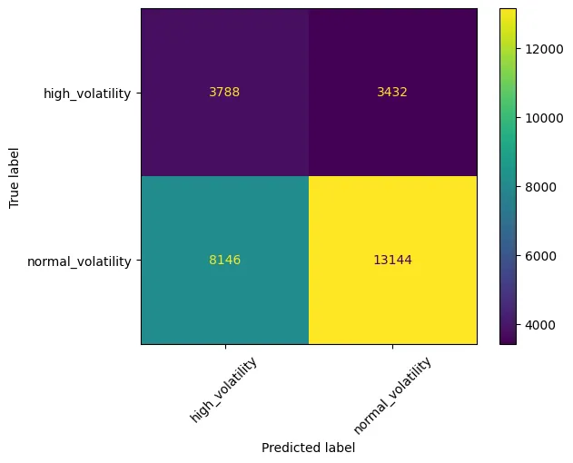
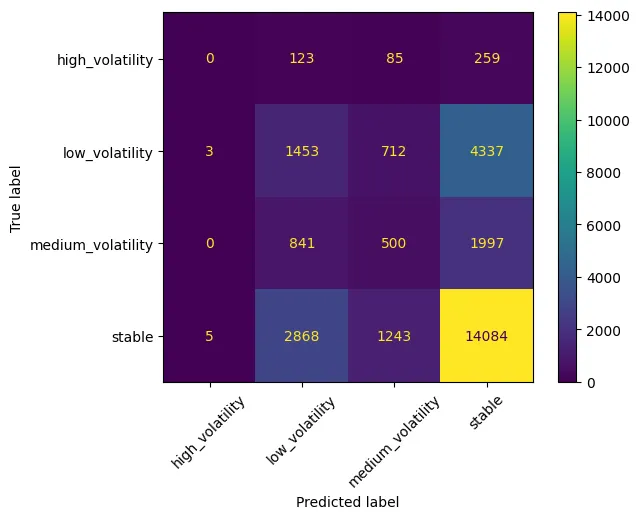
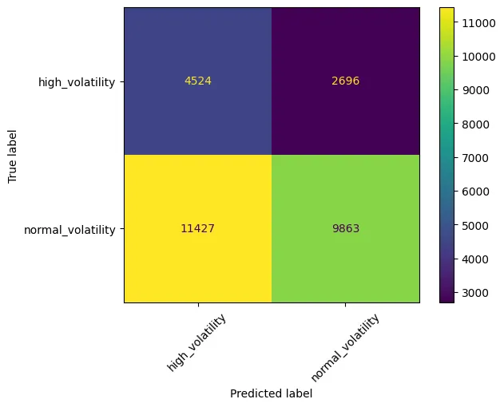

# News-Based Cryptocurrency Volatility Prediction

This project implements a machine learning pipeline that predicts cryptocurrency price volatility using financial news sentiment analysis. The system combines OHLCV (Open, High, Low, Close, Volume) price data with news summaries to forecast future market volatility patterns.

## Overview

The input to the models consisted of a 30-minute window of news leading up to the event, sliding in 15-minute time steps. The data were labeled in two-class (high/low volatility) and four-class (very low, medium, stable, very high) classifications.
For modeling news texts, two advanced language models were used in 1 epoch. The FinBERT model was used to analyze summarized news (obtained in the previous stages of Pegasus) and showed good performance in both two-class and multi-class classification modes.

**target: range** 
`ohlcv_df['range'] = (ohlcv_df['future_high'] - ohlcv_df['future_low']) / ohlcv_df['close'] * 100`

*Used subtitle/title instead of nan values*

## Features

- **Multi-Modal Data Fusion**: Combines OHLCV price data with financial news
- **Automated Volatility Labeling**: Creates volatility categories based on future price ranges
- **News Aggregation**: Groups news by minute-level timestamps for precise alignment
- **FinBERT Integration**: Uses pre-trained financial language model for sentiment analysis
- **BigBird Integration**: Uses pre-trained language model for sentiment analysis
- **Flexible Time Horizons**: Configurable prediction windows (default: 15 steps)
- **Comprehensive Evaluation**: Includes accuracy, precision, recall, F1-score, and confusion matrix


## Model Architecture

### 1. Data Preprocessing Pipeline

#### Volatility Calculation
```python
# Future price range calculation
future_high = ohlcv_df['high'].rolling(window=steps).max().shift(-steps)
future_low = ohlcv_df['low'].rolling(window=steps).min().shift(-steps)
price_range = (future_high - future_low) / close_price * 100
```

#### Volatility Categories

Binary classes:
- **high_volatility**: >= 0.3 price range
- **normal_volatility**: <= 0.3 price range

Multi classes:
- **High Volatility**: ≥ 0.8% price range
- **Medium Volatility**: 0.4% - 0.8% price range  
- **Low Volatility**: 0.25% - 0.4% price range
- **Stable**: < 0.25% price range


### 2. News-OHLCV Data Fusion

The system aligns news and price data using minute-level timestamps:

```python
# Timestamp alignment
ohlcv_df['minute'] = ohlcv_df['dateTime'].dt.floor('min')
news_df['minute'] = news_df['releasedAt'].dt.floor('min')

# News aggregation per minute
news_per_minute = news_df.groupby('minute')['pegasus_summ']
    .apply(lambda x: ' | '.join(x)).reset_index()
```

### 3. FinBERT Classification

**Model**: ProsusAI/finbert - Pre-trained financial sentiment model
**Architecture**: BERT-base with classification head
**Input**: Concatenated news summaries (max 512 tokens)
**Output**: Volatility category probabilities

## Key Functions

### `NewsDataset(Dataset)`
PyTorch dataset class for handling tokenized news data.

**Parameters:**
- `texts`: List of news text summaries
- `labels`: Encoded volatility labels
- `tokenizer`: FinBERT tokenizer instance

### `merge_ohlcv_with_exact_news(ohlcv_df, news_df)`
Merges OHLCV and news data based on minute-level timestamps.

**Returns:** DataFrame with aligned OHLCV data and aggregated news

### `prepare_data(news_df, ohlcv_df, steps=15)`
Complete data preprocessing pipeline.

**Parameters:**
- `news_df`: News DataFrame
- `ohlcv_df`: OHLCV DataFrame  
- `steps`: Prediction horizon in time steps

**Returns:** Processed DataFrame with volatility labels

### `train_and_predict(news_df, ohlcv_df, steps=15)`
End-to-end training and evaluation pipeline.

**Returns:** Tuple of (accuracy, precision, recall, f1, predictions, test_data)

### `run_prediction(news_df, ohlcv_df, steps=15)`
High-level interface for running complete prediction workflow.

## Training Configuration

```python
training_args = TrainingArguments(
    output_dir='./results',
    num_train_epochs=1,          # Fast training for prototyping
    per_device_train_batch_size=32,
    gradient_accumulation_steps=1,
    fp16=True,                   # Mixed precision for speed
    dataloader_num_workers=4,    # Parallel data loading
    dataloader_pin_memory=True   # GPU optimization
)
```

## Conclusion

As we can see in the end, by having summary of news and using finbert we can achieve 9% better accuracy.
Although there'll be a cost of time and resources to get those summaries from news.

| Accuracy | two classes | four classes |
| :------- | :---------- | :----------- |
| finbert  | 0.59%       | 0.56%        |
| BigBird  | 0.50%       | -            |

D:\Projects\Base-Model\New folder\images\finbert2.webp
**FinBert 2 classes:**



**FinBert 4 classes:**


**BigBird 2 classes:**
