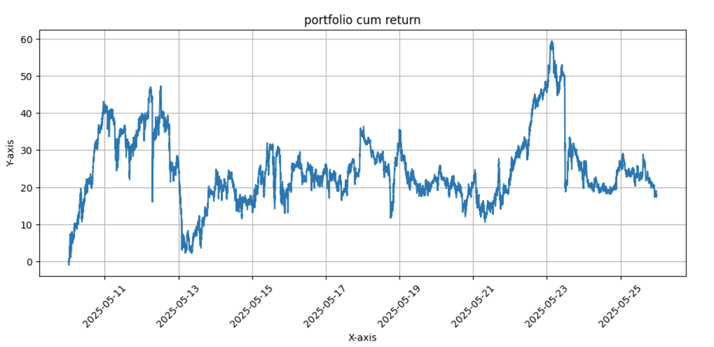

# 🧠📈 News & OHLCV-based Sparse Portfolio Weight Forecasting

## Overview

This project implements a **multimodal deep learning framework** for dynamic portfolio construction using both:
- **Time-series OHLCV data** (from a group of N stocks)
- **Financial news texts** (embedded via an LLM + LSTM)

Unlike traditional approaches that assign weights to all stocks, this model focuses on a **sparse portfolio strategy** by selecting only **M (top-K)** stocks based on the **absolute value of predicted weights** at each decision point.

The model directly forecasts **portfolio weights**, aiming to:
- Maximize **Sharpe Ratio**
- Encourage **diversification**
- Limit exposure to a **subset (M) of N assets** for each allocation period

---

## 🧠 Architecture

### Inputs
- **OHLCV** sequences of N assets over T past minutes
- **News headlines or texts** for each asset

### Components
1. **Transformer Encoder** for OHLCV:
   - Learns temporal and cross-asset features
   - Includes positional encoding

2. **News Encoder**:
   - Uses a pretrained **Financial LLM** (e.g., FinBERT)
   - Followed by **LSTM** to capture news trends

3. **Fusion**:
   - Concatenate time-series and news embeddings
   - Final fully connected layers output raw portfolio weights for all N stocks

---

## 🎯 Sparse Portfolio Loss Function

At each step, the model:
- Selects **top-K assets** with highest absolute weights
- Applies a **Sharpe Ratio loss** over the corresponding return series
- Encourages **weight spreading** among the selected K assets

```python
def func_loss(output, target, top_k=5):
    abs_output = torch.abs(output)
    topk_vals, topk_indices = torch.topk(abs_output, top_k, dim=1)

    weights_topk = torch.gather(output, 1, topk_indices)
    weights_topk = torch.tanh(weights_topk)
    weights_topk = weights_topk / (torch.sum(torch.abs(weights_topk), dim=1, keepdim=True) + 1e-8)

    target_topk = torch.gather(target, 2, topk_indices.unsqueeze(1).expand(-1, target.shape[1], -1))
    weights_exp = weights_topk.unsqueeze(1)
    portfolio_returns = torch.sum(weights_exp * target_topk, dim=2)

    mean_r = torch.mean(portfolio_returns, dim=1)
    std_r = torch.std(portfolio_returns, dim=1) + 1e-6
    sharpe = mean_r / std_r
    loss_sharpe = -torch.mean(sharpe)

    loss_diversify = torch.mean(weights_topk ** 2)
    λ_div = 0.01
    loss = loss_sharpe + λ_div * loss_diversify

    return loss
```

## 📊 Results

### Example: Portfolio Cumulative Return (M = 10 out of N = 20)

The model dynamically selects **10 assets from a pool of 20** at each decision point.

- Cumulative return shows **active behavior** and **periodic rebalancing**
- **Drawdown periods** suggest that alternative asset selection strategies might enhance robustness



---

## 🧪 Experiments

We evaluated the strategy under multiple configurations:

- **Asset pool size (N)**: 10, 20, 30  
- **Active set size (M = top_k)**: 5, 10

### Observations

- Larger **N** gives more selection options but increases **computational cost**
- Smaller **M** results in higher **concentration risk**, but may reduce **transaction fees**
- The method may **underperform** during sharp market shifts if relevant assets are excluded from the top-K selection

### Notes

Potential future improvements include:

- Adding a **penalty for churn** to reduce frequent weight switching
- Exploring **soft top-k selection** mechanisms (e.g., attention-based or Gumbel-Softmax)
