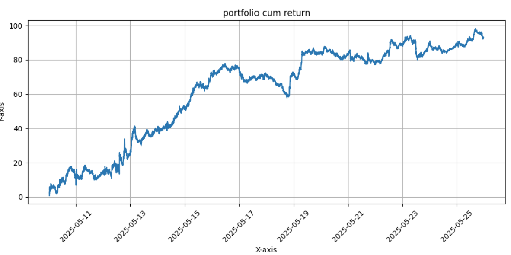

# 🧠📈 News & OHLCV-based Portfolio Weight Forecasting

## Overview

This project implements a **multimodal deep learning system** that predicts **portfolio weights** for a group of stocks using:
- **Time-series data** (OHLCV) modeled with a **Transformer + Positional Encoding**
- **News data**, embedded via a **pretrained Language Model (LLM)** and passed through an **LSTM** to capture temporal sentiment evolution

The model directly forecasts portfolio **weights** for the next period (e.g., 30 minutes) using 1-minute resolution data, aiming to:
- Maximize **Sharpe Ratio**
- Encourage **diversification**
- Produce weights between -1 and 1, such that the **sum of absolute weights is 1**

---

## 🏗️ Model Architecture

### Inputs
- **OHLCV** data of \( N \) assets for past \( T \) minutes
- **News headlines/texts** associated with these assets

### Components
1. **Transformer Encoder**:
   - Input: OHLCV of \( N \) stocks
   - Positional Encoding applied
   - Captures temporal and cross-stock dependencies

2. **News Encoder**:
   - FinBERT or other LLM encodes each news item
   - LSTM summarizes historical news sentiment

3. **Fusion & Forecasting**:
   - Concatenate embeddings from Transformer and LSTM
   - Fully connected layers output **weights** for each stock

---

## 🎯 Objective

The model learns to **predict portfolio weights** by optimizing the following **custom loss function**:

```python
def func_loss(output, target, top_k=7):
    weights = torch.tanh(output)
    weights = weights / (torch.sum(torch.abs(weights), dim=1, keepdim=True) + 1e-8)

    weights_exp = weights.unsqueeze(1)  # [B, 1, N]
    portfolio_returns = torch.sum(weights_exp * target, dim=2)  # [B, T]

    mean_r = torch.mean(portfolio_returns, dim=1)
    std_r = torch.std(portfolio_returns, dim=1) + 1e-6
    sharpe = mean_r / std_r
    loss_sharpe = -torch.mean(sharpe)

    loss_diversify = torch.mean(weights ** 2)  # Encourage distributed weights

    λ_div = 0.01
    loss = loss_sharpe + λ_div * loss_diversify
    return loss
```

## 📊 Results

### Example: Portfolio Cumulative Return (N = 10, 30-minute Horizon)

The model demonstrates the ability to generate smooth, upward-trending portfolio returns using both market data and news sentiment.



---

## 🧪 Experiments

We evaluated the model across multiple configurations:

- **Time horizons**: 30 minutes, 1 hour  
- **Asset count (N)**: 5, 10, 20

### Observations

- Increasing **N** improves **portfolio stability** due to diversification.
- However, larger **N** may lead to **higher transaction costs** (e.g., commissions, slippage).
