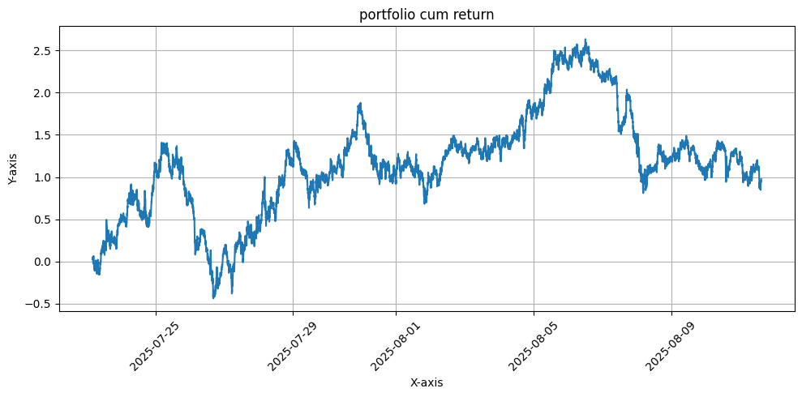

# Direct Portfolio Weight Forecasting with News + OHLCV (Concat Fusion, Sharpe-Ratio + Distribution Loss)

This project directly forecasts **portfolio weights** for a group of assets using multi-modal data (news + OHLCV).  
Unlike return/distribution modeling, the network outputs weights end-to-end. Training uses a **Sharpe-ratio loss** plus an additional **distributional regularization term** to shape the portfolio.

---

## Architecture (Concat Fusion)

- **OHLCV encoder:** a **Transformer** over 3-minute bars.
- **News-text encoder:** an **LSTM** over per-bar **BigBird** news embeddings  
  (multiple news per bar → averaged embedding; if no news, use a learned **[NO_NEWS] embedding**).
- **News-coverage encoder:** an **LSTM** over per-bar **one-hot vectors** (which stocks mentioned).
- **Fusion:** concatenate the three embeddings → **Linear head** → **predicted weights** for all assets.

---

## Data & Setup

- **Timeframe:** 3-minute bars  
- **Input Window:** 80 timestamps (≈ 4 hours)  
- **Prediction Horizon:** next 80 timestamps (≈ 4 hours)  
- **Assets:** configurable stock universe

---

## Loss Function

We use a **two-term objective**:

1. **Sharpe Ratio Loss** (maximize Sharpe over next 4h horizon):
   \[
   \mathcal{L}_{\text{Sharpe}} = - \frac{\mathbb{E}[R_p]}{\sqrt{\operatorname{Var}(R_p) + \epsilon}}
   \]

2. **Distribution Loss** (encourages diversification / smooth weight allocation):
   - Examples: entropy term, L2 penalty on concentration, KL vs. uniform, etc.
   \[
   \mathcal{L}_{\text{dist}} = \lambda \cdot f(w_t)
   \]

**Total Loss:**
\[
\mathcal{L} = \mathcal{L}_{\text{Sharpe}} + \mathcal{L}_{\text{dist}}
\]

where \(w_t\) are predicted portfolio weights.

---

## Portfolio Construction (Test Phase)

- Predicted weights are directly applied to construct portfolios.
- Optionally apply **top-k filtering**:
  - Keep top-k assets by absolute weight
  - Re-normalize to sum=1
- Can be **long-only** or **long/short**, depending on normalization.

---

## How to Run

1. Prepare data:
   - **OHLCV** (3-min bars)
   - **News** (text + coverage one-hot)
2. Open:
   ```
   Transformer+LLM_Concat_portfolio_30of30_news.ipynb
   ```
3. Train with Sharpe + distribution loss (best checkpoint by validation Sharpe).
4. Test: generate predicted weights, apply top-k if needed, evaluate portfolio.

---

## Dependencies

- Python 3.10+
- PyTorch 2.x
- Hugging Face `transformers` (BigBird)
- numpy, pandas, matplotlib, scikit-learn

```bash
pip install torch transformers numpy pandas matplotlib scikit-learn
```

---

## Outputs

- Predicted weights per timestamp (CSV/Parquet)
- Portfolio metrics: Sharpe, P&L, drawdown, turnover
- Plots: equity curve, weight heatmap, rolling Sharpe

---

## Notes

- The **distribution loss** prevents the model from collapsing into one-asset bets.
- **Top-k filtering** provides flexibility for practical portfolio constraints.
- Possible extensions:
  - Replace concat with **cross-gated fusion**
  - Use other risk-adjusted metrics (Sortino, Omega) as primary loss
  - Add transaction-cost-aware regularizers

---


