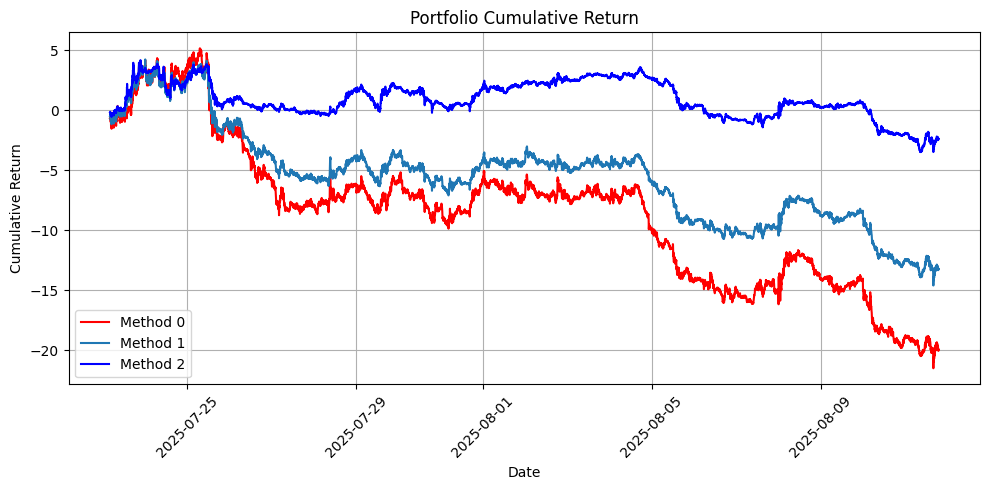

# Gaussian Return Forecasting with News + OHLCV (Cross-Gated Fusion)

This project predicts **per-asset Gaussian distributions** of next-step returns (mean + variance for each stock).  
Instead of learning a full joint covariance, we use **historical covariance matrices** during portfolio construction.  

---

## Pipeline

1. **News Processing**
   - Each news article is encoded using **BigBird**.
   - If multiple news appear in one 3-minute bar → average their embeddings.
   - If no news → use a special **[NO_NEWS] embedding**.
   - **Coverage one-hot (which stocks are mentioned)** is concatenated with the embedding at each timestamp.
   - The combined vector sequence is fed into a **single LSTM**.

2. **OHLCV Features**
   - A **Transformer** processes sequences of OHLCV data (3-min bars).

3. **Fusion**
   - Instead of simple concatenation, we use **Cross-Gated Fusion**:
     - Lets the model control how much information flows from news vs OHLCV.
     - Produces a joint representation of market + news.

4. **Distribution Prediction**
   - From fused embedding, a linear head outputs:
     - **μᵢ** (mean return) for each stock
     - **σᵢ²** (variance) for each stock
   - Each stock is modeled as an **independent Gaussian**.

5. **Loss**
   - Trained with **negative log-likelihood (NLL)** of Gaussian per asset:
     \[
     \mathcal{L} = -\sum_i \log \mathcal{N}(r_{t+1,i} \mid \mu_{t,i}, \sigma_{t,i}^2).
     \]

---

## Portfolio Construction (Test Phase)

- Since the model predicts only per-asset Gaussian distributions (no correlations),  
  we use **historical covariance matrices** estimated from a rolling window of returns.

Three portfolio methods are applied:

1. **Mean-Variance (long-only, top-m assets)**  
   Uses predicted μ and historical Σ.

2. **Minimum-Variance / Risk-Parity (long-only)**  
   Uses historical Σ only.

3. **Long-Short Top-k with tanh scaling + L1 normalization**  
   Uses predicted μ for directional bets, covariance for scaling risk.

---

## How to Run

1. Prepare:
   - **OHLCV data** (3-min bars)
   - **News data** (text + asset mentions)
2. Open the notebook:  
   ```
   Transformer+LLM_Concat_portfolio_gaussian_news.ipynb
   ```
3. Run training (best checkpoint saved by val NLL).
4. Run test phase:
   - Forecast per-asset Gaussian (μ, σ²).
   - Construct portfolios using historical covariance.
   - Plot performance metrics (P&L, Sharpe, drawdown).

---

## Dependencies

- Python 3.10+
- PyTorch 2.x
- Hugging Face `transformers` (BigBird)
- numpy, pandas, matplotlib, scikit-learn

Install:
```bash
pip install torch transformers numpy pandas matplotlib scikit-learn
```

---

## Outputs

- Predicted per-stock means & variances
- Portfolio weights (CSV) from 3 strategies
- Evaluation metrics (Sharpe, NLL, etc.)
- Plots: equity curves, volatility, risk diagnostics

---

## Notes

- Cross-Gated Fusion allows **dynamic weighting** between OHLCV and news signals.
- Using **historical covariance** reduces model complexity but may miss real-time shifts in correlation.
- Extensible to:
  - Mixtures of Gaussians per stock
  - Learned dynamic covariance (full joint distribution)

---


