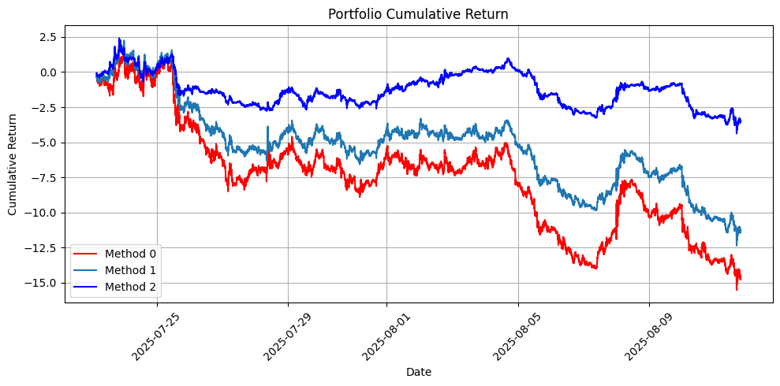

# Joint Distribution Forecasting with News + OHLCV

This project predicts the **joint distribution of returns** for a group of assets using both **news data** and **OHLCV features**.  
The model combines multiple inputs and then builds **portfolios** on test data.

---

## Pipeline

1. **News Embeddings**
   - Each news article is encoded using **BigBird**.
   - If multiple news appear in one 3-minute bar → average their embeddings.
   - If no news → use a special **[NO_NEWS] embedding**.

2. **Coverage Embeddings**
   - A one-hot vector indicates which stocks the news refers to.
   - A separate **LSTM** processes this sequence.

3. **OHLCV Features**
   - A **Transformer** processes sequences of OHLCV data for each asset.

4. **Fusion**
   - Outputs of the three networks are concatenated.
   - A linear layer predicts:
     - **μ** (mean returns vector)
     - **Σ** (covariance matrix via Cholesky)

5. **Loss**
   - Trained with **negative log-likelihood** of the multivariate Gaussian.

---

## Portfolio Construction (Test Phase)

Using the predicted distribution, we generate portfolio weights with three methods:

1. **Mean-Variance (long-only, top-m assets)**  
2. **Minimum-Variance / Risk-Parity (long-only)**  
3. **Long-Short Top-k with tanh scaling + L1 normalization**

---

## How to Run

1. Prepare aligned **OHLCV data** (3-minute bars) and **news data** with timestamps.
2. Open and run the notebook:  
   ```
   Transformer+LLM_Concat_portfolio_joint_v7_news.ipynb
   ```
3. Training will save the best checkpoint (based on validation NLL).
4. Run the test section to:
   - Predict return distributions
   - Construct portfolios (methods A, B, C)
   - Plot P&L, Sharpe, drawdowns, and correlation heatmaps.

---

## Dependencies

- Python 3.10+
- PyTorch 2.x
- Hugging Face `transformers` (for BigBird)
- numpy, pandas, matplotlib, scikit-learn

Install:
```bash
pip install torch transformers numpy pandas matplotlib scikit-learn
```

---

## Outputs

- Portfolio weights (CSV)
- Evaluation metrics (Sharpe, NLL, etc.)
- Plots (equity curves, risk diagnostics)

---


