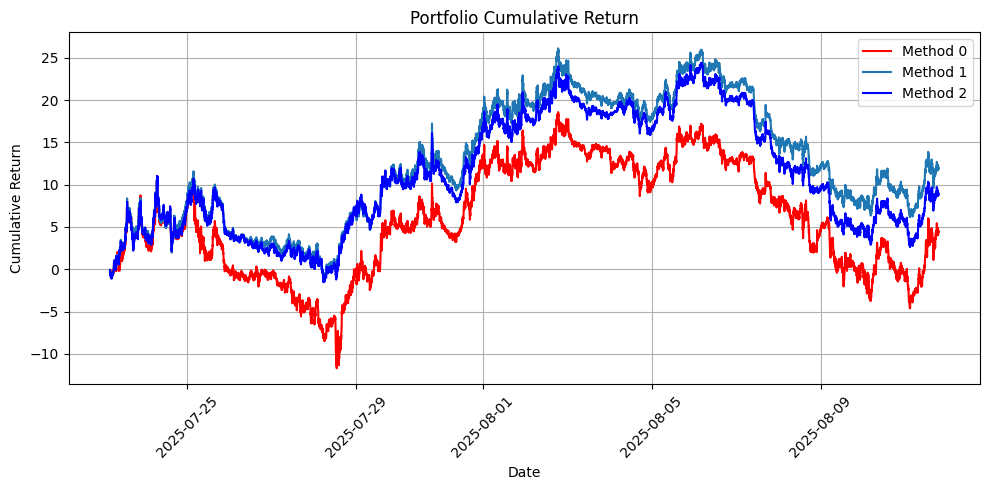

# Pointwise Return Forecasting with News + OHLCV (Cross-Gated Fusion)

This project predicts **pointwise next-step returns** for each asset (deterministic regression, no per-asset distribution).  
Portfolio construction uses **historical volatility and covariance** matrices estimated from past returns.

---

## Pipeline

1. **News Processing**
   - Each news article is encoded using **BigBird**.
   - If multiple news appear in one 3-minute bar → average their embeddings.
   - If no news → use a special **[NO_NEWS] embedding**.
   - **Coverage one-hot (which stocks are mentioned)** is concatenated with the embedding at each timestamp.
   - The combined vector sequence is fed into a **single LSTM**.

2. **OHLCV Features**
   - A **Transformer** processes sequences of OHLCV data (3-min bars).

3. **Fusion**
   - Instead of simple concatenation, we use **Cross-Gated Fusion**:
     - Learns to dynamically control how much information flows from news vs OHLCV.
     - Produces a joint representation of market + news.

4. **Return Prediction**
   - From the fused embedding, a linear head outputs **predicted point returns** (μ̂ᵢ) for each stock.

5. **Loss**
   - Trained with **MSE loss** (Mean Squared Error) between predicted and actual returns:
     \[
     \mathcal{L} = \frac{1}{N} \sum_i (r_{t+1,i} - \hat{r}_{t,i})^2
     \]

---

## Portfolio Construction (Test Phase)

- Since we only predict **pointwise returns**, volatility and correlation come from **historical covariance matrices**.

Three portfolio methods are applied:

1. **Mean-Variance (long-only, top-m assets)**  
   Uses predicted returns μ̂ and historical Σ.

2. **Minimum-Variance / Risk-Parity (long-only)**  
   Uses historical Σ only.

3. **Long-Short Top-k with tanh scaling + L1 normalization**  
   Uses predicted returns μ̂ for signal, covariance for scaling risk.

---

## How to Run

1. Prepare:
   - **OHLCV data** (3-min bars)
   - **News data** (text + asset mentions)
2. Open the notebook:  
   ```
   Transformer+LLM_Concat_portfolio_pointwise_news.ipynb
   ```
3. Run training (best checkpoint saved by val MSE).
4. Run test phase:
   - Predict per-asset returns μ̂.
   - Construct portfolios using historical covariance.
   - Plot performance metrics (P&L, Sharpe, drawdown).

---

## Dependencies

- Python 3.10+
- PyTorch 2.x
- Hugging Face `transformers` (BigBird)
- numpy, pandas, matplotlib, scikit-learn

Install:
```bash
pip install torch transformers numpy pandas matplotlib scikit-learn
```

---

## Outputs

- Predicted per-stock returns (μ̂)
- Portfolio weights (CSV) from 3 strategies
- Evaluation metrics (Sharpe, MSE, etc.)
- Plots: equity curves, volatility, risk diagnostics

---

## Notes

- Cross-Gated Fusion allows **dynamic weighting** between OHLCV and news signals.
- Historical covariance provides stability but may lag regime changes.
- Extensible to:
  - Gaussian outputs per stock (uncertainty)
  - Full joint distribution forecasting

---


