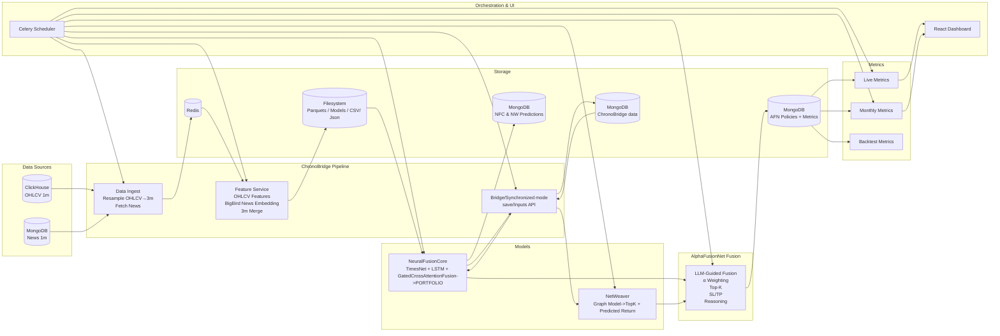

# AlphaFusionNet Architecture

AlphaFusionNet is a hybrid portfolio decision-making engine that fuses deep quantitative modeling with qualitative LLM-guided policy reasoning. It integrates real-time multimodal data ingestion, feature engineering, TimesNet-based MarketNews gated-fusion modeling, graph modeling, fusion logic, and full metric monitoring, all orchestrated in UTC via Celery.

This document provides a full overview of the architecture, components, and data flow.

---

# 1. High-Level System Overview

AlphaFusionNet consists of the following major subsystems:

- **ChronoBridge Data Pipeline**  
  Fetches OHLCV + news, resamples, embeds text, merges features.

- **NeuralFusionCore**  
  Risk-aware signals using TimesNet + LSTM + gated fused attention.

- **NetWeaver**  
  Graph neural network for return prediction & top-K selection.

- **AlphaFusionNet Fusion Engine**  
  Combines NeuralFusionCore & NetWeaver outputs using an LLM-generated policy.

- **Metrics System**  
  Live and monthly pipelines (MongoDB + CSV).

- **Orchestration**  
  All services run via Celery Scheduler in UTC.

- **Dashboard**  
  React frontend visualizing policy, metrics, and allocations.

---

# 2. Architecture Diagram


---
# 3. ASCII Diagram 
```text
┌──────────────────────────────┐
│        Data Sources          │
│  - ClickHouse (OHLCV 1m)     │
│  - MongoDB (News 1m)         │
└───────────────┬──────────────┘
                │
        ┌───────▼──────────────────────────┐
        │      ChronoBridge Pipeline       │
        │  • Data Ingest (3m resample)     │
        │  • Feature Service (OHLCV+News)  │
        │  • BigBird Embeddings            │
        │  • train/val parquet + meta.json │
        │  • online_test parquet           │
        └───────┬──▲─────────────────────┬─┘
                │  │                     │
                │ Bridge/Synchronous Model
                │  │                     │
       ┌────────▼──────────────┐   ┌─────▼───────┐
       │ NeuralFusionCore      │   │ NetWeaver   │
       │ MSGCAF(TimesNet+LSTM) │   │ Graph Model │
       │ Risk-aware Weights    │   │(Return Pred)│
       └────────┬──────────────┘   └──┬──────────┘
                │                     │
                └──────────┬──────────┘
                           ▼
        ┌────────────────────────────────┐
        │    AlphaFusionNet              │
        │LLM Policy(α,K,SL,TP,method)    │
        │  Combine NFC+NW weights        │
        │Final Portfolio Output+reasoning│
        └──────────────────┬─────────────┘
                           ▼
                 ┌────────────────────┐
                 │   Metrics System   │
                 │ Live / Monthly /   │
                 │ Backtesting (CSV)  │
                 └──────────┬─────────┘
                            ▼
                   React Dashboard
```
---
# 4. ChronoBridge Data Pipeline

ChronoBridge is the real-time data preparation layer for AlphaFusionNet. It ingests raw market and news data, performs multimodal feature engineering, and provides synchronized inputs for NeuralFusionCore and NetWeaver.

---

## 4.1 Data Ingest Service

The Data Ingest Service is responsible for collecting and preprocessing raw data.

### Inputs
- OHLCV price data (1-minute) from ClickHouse  
- News data (1-minute) from MongoDB

### Processing
- Resamples OHLCV data from 1-minute to 3-minute intervals  
- Forwards news as-is (preserving timestamps)  
- Streams OHLCV (3m) and news (1m) into Redis  
- Ensures all timestamps are handled in UTC  
- Maintains symbol-level alignment and schema consistency

### Outputs
- Redis streams:  
  - `ohlcv_3m`  
  - `news_raw`  
- Downstream services read structured, time-aligned data from Redis

---

## 4.2 Feature Service

The Feature Service creates multimodal features from OHLCV and news.

### OHLCV Feature Engineering
- Features derived from 3-minute OHLCV bars  
- Rolling-window metrics such as returns and volatility-like features

### Timesnet mask features
- Features derived from timestamps for timesnet.

### News Embedding
- Uses a BigBird transformer model to generate dense vector embeddings from text  
- Resamples and aligns news embeddings to the 3-minute grid.

### Symbol–News Alignment
- Identifies which symbols are referenced by each news item  
- Encodes symbol associations as one-hot vectors  
- Ensures news relevance is reflected in the feature set

### Merged Feature DataFrame
- Contains:  
  - OHLCV features (all symbols)  
  - Time features (from timestamps)
  - News embeddings  
  - One-hot news–symbol indicators  
- Fully synchronized to a 3-minute timestamp grid  
- Serves as the core multimodal dataset for model training and live inference

---

## 4.3 Training Mode Outputs

When ChronoBridge feature servuice runs in training mode, it generates datasets for NeuralFusionCore.

### Train/Validation Split
- Splits merged features into:  
  - `train`  
  - `validation`  

### Normalization
- Computes normalization parameters using only the training subset  
- Applies the same normalizer to the validation subset  
- Prevents data leakage and ensures deterministic preprocessing

### Output Files (saved under `data/processed/`)
- `train.parquet` — normalized training dataset  
- `val.parquet` — normalized validation dataset  
- `meta.json` — normalizer parameters, schema, and config metadata

---
## 4.4 Bridge Mode 
When ChronoBridge service runs in this mode, it generates datasets for NetWeaver.

### Pipline
1. Fetch latest raw market & news data
2. Generate lagged features + embeddings
3. Slide through the time series row-by-row:
     ▸ build rolling window of features and news embeddings
     ▸ run NFC model forward pass with `return_embeddings=True`
     ▸ extract per-asset fused representations
4. Persist fused embeddings, OHLCV, and timestamp to:
     ▸ MongoDB  (collection: `chrono_bridge`)
5. Exposes a Chronobridge API for NW training data.
---
## 4.5 Synchronized Mode (Inference Service)

synchronized Mode ensures both models receive consistent, synchronized inputs during live inference.

### Responsibilities
- Builds a 4-hour history window of 3-minute merged features  
- Ensures NeuralFusionCore and NetWeaver operate on:  
  - The same timestamp (`t0`)  
  - The same window length  
  - The same multimodal features  
- Fetches the latest fused embedding output from NeuralFusionCore for NetWeaver  
- Exposes a unified inference API for synchronous prediction

### Purpose
synchronized Mode prevents timing misalignment and ensures both models operate on identical context, enabling coherent final decisions in AlphaFusionNet.
