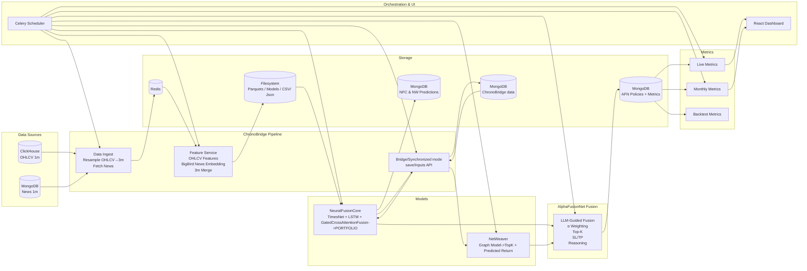

# AlphaFusionNet — System Architecture

AlphaFusionNet is a **financial decision intelligence system** designed to support **market monitoring, risk assessment, structural analysis, and policy-driven reasoning** in complex financial environments.

The system integrates quantitative modeling, graph-based dependency analysis, and LLM-guided policy interpretation to provide **risk-aware insights** derived from real-time multimodal data.  
AlphaFusionNet does **not** generate execution instructions or investment recommendations.

This document describes the full architecture, core components, and data flow.

---

## 1. High-Level System Overview

AlphaFusionNet consists of the following subsystems:

- **ChronoBridge Data Pipeline**  
  Multimodal data ingestion, synchronization, and feature construction (prices + news).

- **NeuralFusionCore (NFC)**  
  Context-aware representation learning over temporal and textual signals, producing **risk- and salience-oriented scores**.

- **NetWeaver**  
  Graph-based modeling of cross-asset relationships and dependency structure.

- **AlphaFusionNet Policy & Fusion Layer**  
  Policy-driven fusion of model outputs using LLM reasoning (non-executive, non-directional).

- **Metrics & Monitoring System**  
  Continuous generation of descriptive, diagnostic, and governance metrics.

- **Orchestration Layer**  
  Deterministic scheduling and coordination of all services.

- **Dashboard Layer**  
  Visualization of market state, structural dependencies, and monitoring metrics.

---

# 2. Architecture Diagram


---
# 3. ASCII Diagram 
```text
┌──────────────────────────────┐
│        Data Sources          │
│  - ClickHouse (OHLCV 1m)     │
│  - MongoDB (News 1m)         │
└───────────────┬──────────────┘
                │
        ┌───────▼──────────────────────────┐
        │      ChronoBridge Pipeline       │
        │  • Data Ingest (3m resample)     │
        │  • Feature Service (OHLCV+News)  │
        │  • BigBird Embeddings            │
        │  • train/val parquet + meta.json │
        │  • online_test parquet           │
        └───────┬──▲─────────────────────┬─┘
                │  │                     │
                │ Bridge/Synchronous Model
                │  │                     │
       ┌────────▼──────────────┐   ┌─────▼───────┐
       │ NeuralFusionCore      │   │ NetWeaver   │
       │ MSGCAF(TimesNet+LSTM) │   │ Graph Model │
       │ Risk-aware Weights    │   │(Return Pred)│
       └────────┬──────────────┘   └──┬──────────┘
                │                     │
                └──────────┬──────────┘
                           ▼
        ┌────────────────────────────────┐
        │    AlphaFusionNet              │
        │LLM Policy(α,K,SL,TP,method)    │
        │  Combine NFC+NW weights        │
        │Final Portfolio Output+reasoning│
        └──────────────────┬─────────────┘
                           ▼
                 ┌────────────────────┐
                 │   Metrics System   │
                 │ Live / Monthly /   │
                 │ Backtesting (CSV)  │
                 └──────────┬─────────┘
                            ▼
                   React Dashboard
```
---

## 3. Core Design Principle 

AlphaFusionNet is explicitly designed as:

> **A monitoring, diagnostics, and decision-support system — not an execution or advisory engine.**

All outputs are:
- descriptive, not prescriptive  
- structural, not directional  
- risk- and context-oriented, not performance-oriented  

---

## 4. ChronoBridge Data Pipeline

ChronoBridge is the **data normalization and synchronization layer** of AlphaFusionNet.  
Its role is to ensure that **all downstream components operate on aligned, consistent, and temporally coherent information**.

### 4.1 Data Ingest Service

**Inputs**
- OHLCV market data (1-minute resolution)
- News data with original timestamps

**Responsibilities**
- Resample OHLCV to a unified temporal grid (e.g., 3-minute)
- Preserve original news timing
- Enforce UTC consistency
- Maintain schema and symbol alignment

**Outputs**
- Time-aligned streams delivered via Redis for downstream services

---

### 4.2 Feature Service

The Feature Service constructs **multimodal representations** used by learning and graph components.

**Price-Derived Features**
- Rolling statistics and temporal descriptors
- Volatility- and movement-related signals (non-directional)

**Temporal Encoding**
- Time-based masks and positional features

**Textual Processing**
- Transformer-based embeddings (BigBird)
- Alignment of news embeddings to the unified time grid

**Symbol Association**
- Encodes relevance between news items and symbols
- Enables symbol-level contextualization without sentiment-based execution logic

The resulting dataset forms the **canonical feature space** for all models.

---

### 4.3 Training Mode Outputs

When operating in training mode, ChronoBridge produces:

- Normalized training and validation datasets
- Explicit metadata describing preprocessing and schema
- Deterministic splits to prevent data leakage

These artifacts are used exclusively for **representation learning**, not signal generation.

---

### 4.4 Bridge Mode (Graph Preparation)

In bridge mode, ChronoBridge:

- Generates rolling contextual windows
- Extracts intermediate representations from NeuralFusionCore
- Persists synchronized embeddings and metadata

This data serves as **structural input** for NetWeaver’s dependency modeling.

---

### 4.5 Synchronized Inference Mode

Synchronized mode guarantees that:

- NeuralFusionCore and NetWeaver observe the **same market context**
- Temporal misalignment is eliminated
- Downstream fusion logic operates on coherent inputs

This design is critical for **interpretability, auditability, and governance**.

---

## 5. NeuralFusionCore (NFC)

NeuralFusionCore is a **contextual representation engine** that learns how temporal price behavior and textual information co-evolve.

Its outputs should be interpreted as:
- salience measures
- risk-aware intensity indicators
- contextual embeddings  

They are **not** actionable instructions.

---

## 6. NetWeaver (Dependency Modeling)

NetWeaver models **cross-symbol relationships** using graph-based learning.

It focuses on:
- influence structure
- dependency strength
- lead–lag patterns (probabilistic, historical)

These outputs describe **market structure**, not future outcomes.

---

## 7. AlphaFusionNet Policy & Fusion Layer

This layer uses LLM-based reasoning to:

- Combine heterogeneous model outputs
- Apply governance and risk policies
- Produce structured, human-readable interpretations

Importantly:
- Policies are **non-executable**
- No allocation, trade, or action instructions are produced

---

## 8. Metrics & Monitoring System

AlphaFusionNet produces metrics for:

- Market condition monitoring
- Risk concentration awareness
- Structural stability analysis
- Model consistency and data quality checks

Metrics are used for **oversight and diagnostics**, not performance claims.

---

## 9. Dashboard Layer

The dashboard visualizes:

- Market-level condition summaries
- Watchlist rationale (monitoring-focused)
- Dependency graphs and correlation structures
- Data quality and model agreement indicators

It is designed for **situational awareness**, not transaction execution.

---

## Final Note

AlphaFusionNet is a deep-tech financial intelligence system built to support **responsible, transparent, and risk-aware decision processes** in regulated environments.
